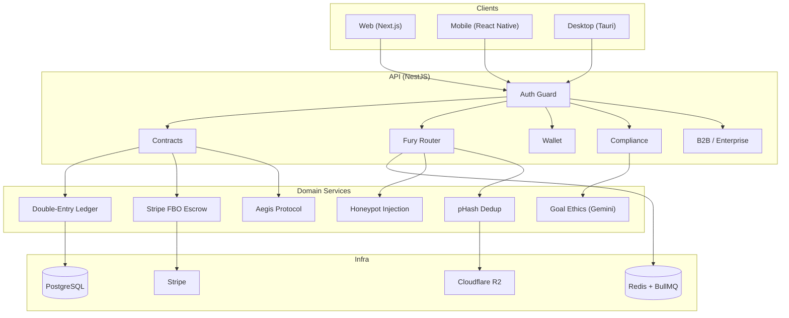

# Styx: The Blockchain of Truth

A peer-audited behavioral market that uses loss aversion (coefficient 1.955) to enforce habit follow-through via financial stakes.


---

## Table of Contents

- [Quick Start](#quick-start)
- [Architecture](#architecture)
- [Key Features](#key-features)
- [Testing](#testing)
- [Commands](#commands)
- [API Documentation](#api-documentation)
- [Environment](#environment)
- [CI Pipeline](#ci-pipeline)
- [Security](#security)

## Quick Start

```bash
# Prerequisites: Node.js >= 20, Docker, npm 10+

# Start infrastructure (PostgreSQL + Redis)
docker-compose up -d

# Install dependencies across all workspaces
make install

# Run database migrations
cd src/api && npm run migrate && cd ../..

# Run all services (API + Web + Mobile)
make dev
```

Docker services: PostgreSQL on `5432`, Redis on `6379`, API on `3000`, Web on `3001`.

## Architecture

Turborepo monorepo with **npm** workspaces. Package scope: `@styx/*`.

| Workspace | Package | Stack | Role |
|-----------|---------|-------|------|
| `src/api` | `@styx/api` | NestJS 11, BullMQ, Stripe, PostgreSQL | Backend — ledger, escrow, Fury Router, oracles |
| `src/web` | `@styx/web` | Next.js 16, React 18, Tailwind | Dashboard, Fury workbench |
| `src/mobile` | `@styx/mobile` | React Native 0.81 | Sensor bridge, camera, biometrics |
| `src/desktop` | `@styx/desktop` | Tauri 2.0, Vite, React | "The Judge" admin dashboard |
| `src/shared` | `@styx/shared` | TypeScript | Constants, types, algorithms |
| `src/pitch` | `@styx/pitch` | Vite, React 18, p5.js | Interactive pitch deck |



### Tech Stack

- **Runtime**: Node.js 20+
- **Package Manager**: npm (workspaces + Turborepo)
- **Database**: PostgreSQL 15 (double-entry ledger with ACID)
- **Queue**: Redis 7 + BullMQ (Fury Router)
- **Payments**: Stripe (FBO escrow — hold/capture/cancel)
- **Storage**: Cloudflare R2 (zero-egress media hosting)
- **AI**: Gemini 2.5 Flash (goal ethics screening, VC questions, ELI5)
- **Logging**: Pino (structured JSON in production, pretty-print in dev)
- **Security**: Helmet, rate limiting, JWT auth, geofencing
- **CI/CD**: GitHub Actions (test + build + lint + gates + CodeQL + E2E)
- **IaC**: Terraform (Render services, Cloudflare R2, WAF rules)
- **API Docs**: OpenAPI/Swagger at `/api/docs`

## Key Features

- **Double-Entry Ledger** — Every financial transaction is a balanced debit/credit pair. No phantom money.
- **Fury Peer Review** — Anonymous auditors verify proof submissions via BullMQ queue. Consensus engine aggregates verdicts.
- **Bounty Economy** — Furies earn bounties for correct verdicts and pay penalties for false accusations or honeypot failures.
- **Hash-Chained Audit Log** — SHA-256 linked event log for tamper-evident history.
- **Honeypot Injection** — System injects known-fail proofs to QA reviewer accuracy.
- **Aegis Protocol** — BMI floor (18.5), 2% weekly loss velocity cap, weekend multipliers for predictable vulnerability windows.
- **Geofencing** — Jurisdiction-based tier restrictions by US state (FULL_ACCESS / RESTRICTED / PROHIBITED).
- **Linguistic Cloaker** — Runtime vocabulary swap (stake/vault, bet/commitment) for App Store compliance.
- **Integrity Scoring** — `Base(50) + 5/completion - 15/fraud - 20/strike - 1/inactive_month`. Score determines financial tier access.
- **Goal Ethics Screening** — Gemini 2.5 Flash content policy check on user-submitted goals.
- **Identity Verification** — KYC/age verification via Stripe Identity (production) or mock adapter (dev).

## Testing

**1,107 tests** across all workspaces (Jest + ts-jest) plus Playwright E2E.

```bash
make test                                        # All unit/integration tests via Turborepo
cd src/api && npx jest                           # API tests only (640)
cd src/mobile && npx jest                        # Mobile tests only (273)
cd src/web && npx jest                           # Web tests only (166)
cd src/desktop && npx jest                       # Desktop tests only (128)
npx jest --testNamePattern="should reject"       # Single test by name

# E2E (Playwright)
make test-e2e                                    # Headless (chromium + firefox)
make test-e2e-ui                                 # Interactive UI mode
npm run test:e2e:headed                          # Headed browser
```

### Validation Gates

```bash
npx tsx scripts/validation/01-phantom-money-check.ts     # Ledger balance integrity
npx tsx scripts/validation/02-simulator-spoof-check.ts    # Oracle spoof detection
npx tsx scripts/validation/03-the-full-loop.ts            # End-to-end contract lifecycle
bash scripts/validation/04-redacted-build-check.sh        # Production vocabulary sweep
npx tsx scripts/validation/05-behavioral-physics-check.ts  # Algorithm constant validation
node scripts/validation/07-claim-drift-check.js           # Claim drift detection
```

## Commands

| Command | Description |
|---------|-------------|
| `make install` | Install all workspace dependencies |
| `make dev` | Start API + Web + Mobile dev servers |
| `make build` | Build all workspaces |
| `make test` | Run all unit/integration tests |
| `make test-e2e` | Run Playwright E2E tests |
| `make docker-up` | Start PostgreSQL + Redis |
| `npx turbo run lint` | TypeScript strict lint |
| `npm run format` | Prettier across all workspaces |
| `npm run clean` | Clean build artifacts + node_modules |
| `cd src/api && npm run migrate` | Run database migrations |
| `bash scripts/setup.sh` | Full bootstrap (docker + install + build + test) |

## API Documentation

Interactive Swagger/OpenAPI docs are available at `/api/docs` when the API is running:

```bash
cd src/api && npm run dev
# Open http://localhost:3000/api/docs
```

## Environment

Copy `.env.example` to `.env` and set:

| Variable | Required | Description |
|----------|----------|-------------|
| `STRIPE_SECRET_KEY` | Yes | Stripe API secret key |
| `STRIPE_PUBLISHABLE_KEY` | Yes | Stripe publishable key |
| `DATABASE_URL` | Yes | PostgreSQL connection string |
| `REDIS_URL` | Yes | Redis connection string |
| `CLOUDFLARE_R2_ACCESS_KEY` | Yes | R2 storage access key |
| `CLOUDFLARE_R2_SECRET_KEY` | Yes | R2 storage secret key |
| `JWT_SECRET` | Yes (prod) | JWT signing secret (enforced in production) |
| `GEMINI_API_KEY` | No | Gemini AI for goal ethics screening |
| `KYC_ENFORCEMENT_ENABLED` | No | Enable KYC gating (default: `false`) |
| `GEOFENCE_FAIL_OPEN_ON_MISSING_HEADERS` | No | Fail-open when geo headers missing (default: `true`) |

## CI Pipeline

`.github/workflows/ci.yml` runs on every push and PR:

1. **Install + Security Audit** — `npm ci`, `npm audit --audit-level=high`
2. **Tests + Coverage** — `turbo run test --coverage --ci` (1,107 tests, per-workspace thresholds)
3. **Build** — `turbo run build` (all workspaces)
4. **Lint** — `turbo run lint` (strict TypeScript)
5. **Gate 04** — Redacted build check (no gambling terminology in production)
6. **Gate 06** — Security invariant check (no hardcoded secrets)
7. **Gate 07** — Claim drift detection
8. **Terraform** — `terraform fmt -check`, `terraform validate`
9. **E2E** — Playwright (chromium + firefox matrix)
10. **CodeQL** — JS/TS static analysis

## Security

See [SECURITY.md](.github/SECURITY.md) for vulnerability disclosure policy and security controls.

## License

MIT. See [LICENSE](LICENSE) for details.
