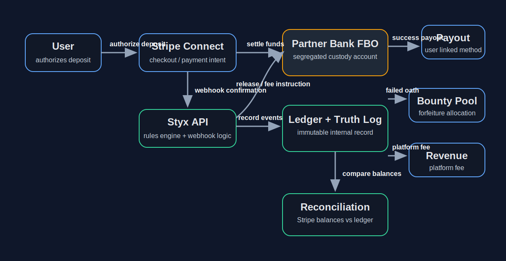

# Appendix A — FBO Architecture Diagram

This appendix visualizes the zero-custody / FBO structure described in the parent legal documents. It is designed for counsel review, Stripe risk review, and internal alignment on which entity touches funds and which entity only records or instructs.

## Rendered Diagram

## Mermaid Source

- Source: `docs/legal/appendices/assets/appendix-a--fbo-fund-flow.mmd`
- Rendered: `docs/legal/appendices/assets/appendix-a--fbo-fund-flow.svg`

## Control Notes

| Flow leg | Operational meaning | Legal significance |
| --- | --- | --- |
| User -> Stripe Checkout / PaymentIntent | User authorizes deposit or hold | Styx does not receive raw card or bank credentials |
| Stripe -> Partner Bank FBO | Funds settle into segregated FBO custody | Supports zero-custody and bank-centric exemption framing |
| Styx API -> Ledger / Truth Log | Styx records the event and state transition | Styx is the control plane, not the custodian |
| Styx API -> Stripe transfer instruction | Styx sends release / payout / fee instruction after verified outcome | Keeps payout logic deterministic and auditable |
| FBO -> User payout method | Funds return directly to user on success or refund trigger | Avoids commingling with Styx operating funds |
| FBO -> Bounty / fee allocation | Forfeited funds and service fees split per published rules | Preserves disclosed allocation logic and auditability |
| Reconciliation loop | Stripe balances compared to internal ledger | Required to prove custody boundaries stay clean over time |

## Parent Cross-References

- `docs/legal/legal--aegis-protocol.md` § 4
- `docs/legal/legal--real-money-activation-brief.md` §§ 3-4, 10
- `docs/legal/legal--gatekeeper-compliance.md` § 1.3
- `docs/legal/regulatory-risk-register.md` R-02, R-03, R-10
