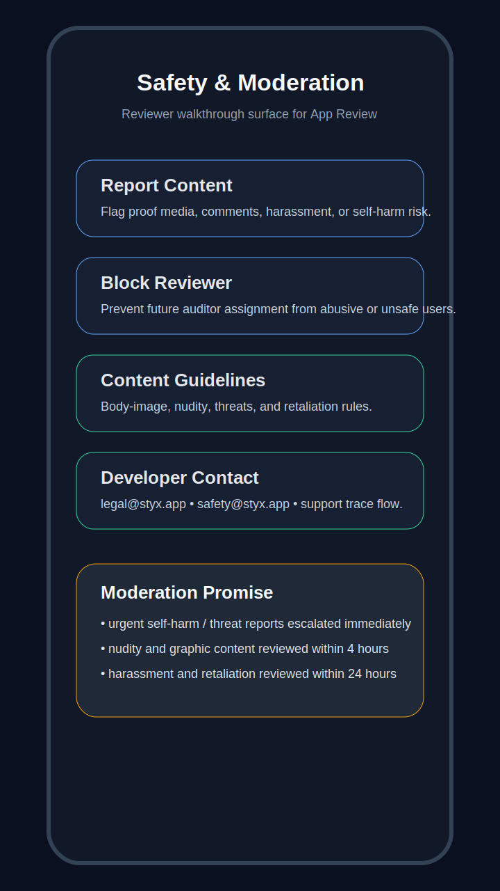
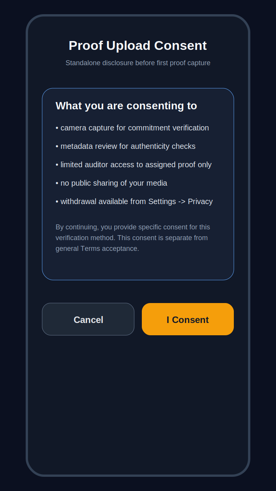
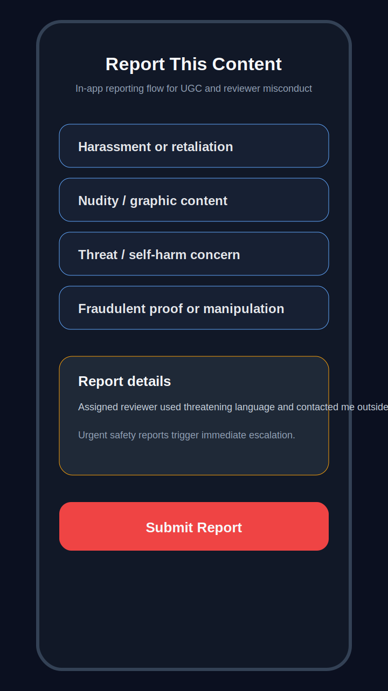

# Appendix C — App Review Screenshot Mockups

These mockups are reviewer-facing communication artifacts, not production screenshots. They exist to support App Review notes, policy walkthroughs, and internal design alignment on the minimum safety surfaces Apple and Google will expect to see.

## Mockup Set

### 1. Safety & Moderation Screen

Reviewer talking points:

- Shows reporting, blocking, contact, and content-guideline entry points in one place.
- Matches the requirement described in `legal--gatekeeper-compliance.md` § 2.2.
- Gives App Review a direct screen to inspect instead of requiring a hunt through the product.

### 2. Consent Flow Screen

Reviewer talking points:

- Separates proof-media consent from general Terms acceptance.
- Makes the disclosure specific to camera, metadata, and auditor review.
- Supports the consent and prominent-disclosure positions in `legal--app-store-ugc-moderation-packet.md`.

### 3. Reporting Mechanism Screen

Reviewer talking points:

- Demonstrates category-based reporting with urgency hints.
- Shows that reporting is available in-app, not only through email.
- Supports the minimum UGC reporting expectation for TestFlight and public launch review.

## Parent Cross-References

- `docs/legal/legal--app-store-ugc-moderation-packet.md` § 6
- `docs/legal/legal--gatekeeper-compliance.md` § 2.2
- `docs/legal/legal--cross-jurisdictional-consent-matrix.md`
